# Lores — Accessible Family Tree & Oral History Builder

<div align="center">

[](https://fastapi.tiangolo.com)
[](https://reactjs.org)
[](https://www.typescriptlang.org/)
[](https://tailwindcss.com)
[](https://python.org)
[](https://www.w3.org/WAI/standards-guidelines/wcag/)
[](https://opensource.org/licenses/MIT)

**Lores** is an accessible, multi-tenant family tree and oral storytelling web platform engineered for families to record, preserve, and explore their lineage, memories, and spoken histories together.

[Key Features](#1-key-features) • [Architecture & Information Flow](#2-architecture--information-flow) • [Quickstart](#3-quickstart--local-development) • [Docker Deployment](#4-running-with-docker) • [Quality & Verification](#5-automated-verification--quality-gates)

</div>

---

## 1. Key Features

Traditional genealogy software often overwhelms families with sprawling, tangled charts, microscopic fonts, complex navigational controls, and archaic terminology (*Ahnentafel*, *Consanguinity*, *Pedigree Collapse*).

**Lores replaces cognitive overload with simplicity, psychological safety, and radical accessibility:**

- 🌿 **1-Hop Focus Neighborhood**: Rather than displaying infinite tangled tree canvases, Lores centers the user on a single **Focus Person** with their immediate parents, partners, siblings, and children displayed in legible, high-contrast cards. Easily pivot focus with a single click, add relatives with automatic union wiring, connect dual parents, and link existing relatives.
- 📸 **Portrait Photos & Face Cropping**: Upload portrait photos with an interactive web-based cropping tool featuring 2D panning, zoom sliders (100%–300%), and automatic Base64 canvas optimization. Avatars render cleanly in both Focus cards and Bird's-Eye SVG map nodes with graceful fallback to initials.
- 🎙️ **Oral Lore & Storytelling**: Attach voice recordings, milestone stories, recipes, and personal anecdotes directly to family members. Includes a **Guided Interview Modal** with structured prompts to spark intergenerational storytelling.
- 🗺️ **Bird's-Eye SVG Map & Custom Layouts**: Multi-generational pedigree map with smooth zoom/pan (10%–300%), bundled partner and parent-child edges, interactive person inspection, drag-and-drop manual node positioning persisted per workspace, and auto-layout reset.
- 📦 **Universal GEDCOM 5.5.1/7.0 & Lossless JSON Portability**: Full data sovereignty with standard `.ged` file export/import (compatible with GrampsWeb, Gramps, Ancestry, and FamilySearch) featuring smart deduplication and cycle prevention, plus complete workspace JSON backup and restore.
- 🔒 **Living Relative Privacy**: Living relatives have sensitive details automatically redacted for guest and unauthorized viewers.
- ↩️ **30-Day Family Safety Net**: Every change is recorded in an immutable append-only audit trail with JSON diffs. Deleted relatives and stories are held in a **30-day Family Trash Can** with 1-click restore and permanent purge capabilities.
- 🛡️ **Multi-Tenant Workspaces & 4-Tier RBAC**: Isolated family workspaces with 4 distinct roles (`owner`, `admin`, `collaborator`, `viewer`), family member invitation flows via email, direct join links, and live role management.
- 🔑 **Dual Authentication (Passwordless OTP & Google SSO)**: Frictionless 6-digit email passcodes dispatched via live SMTP (Resend) alongside Google SSO OAuth2 with automated account creation and unification.
- 📊 **Super Admin Operations Dashboard**: System-wide dashboard for metrics, workspace health, active users, and tenancy oversight.
- ♿ **Strict Accessibility (WCAG 2.1 AA/AAA)**: Integrated High-Contrast Mode, large touch targets ($\ge 44 \times 44\text{px}$), accessible date/place autocomplete, and automated axe-core testing across the entire interface.

---

## 2. Architecture & Information Flow

Lores is structured as a full-stack monorepo:

```
lores/
├── backend/                  # FastAPI (Python 3.12+), SQLAlchemy 2.0 (async), Pydantic v2, SQLite
│   ├── app/
│   │   ├── api/              # RESTful API router (v1 endpoints for auth, tree, people, lore, audit/trash, admin, data exchange)
│   │   ├── db/               # Async engine, sessionmaker, base declarative model
│   │   ├── models/           # SQLAlchemy models (User, Workspace, Person, FamilyUnion, ChildRelationship, LoreNote, AuditLog)
│   │   ├── schemas/          # Pydantic v2 validation & response schemas
│   │   └── services/         # Business logic (cycle detection, neighborhood graph, audit ledger, auth, email, GEDCOM, data exchange)
│   └── tests/                # Pytest async test suite (154 tests, 100% passing)
├── frontend/                 # React 18, TypeScript, Vite, Tailwind CSS, Radix UI, Lucide Icons
│   ├── e2e/                  # Playwright E2E browser accessibility test suite
│   ├── src/
│   │   ├── components/       # UI Components (auth, layout, tree, map, history, workspace, admin, interview)
│   │   ├── lib/              # Type-safe API client, token storage, autocomplete helpers
│   │   └── types/            # TypeScript interfaces matching backend DTO schemas
│   └── tests/                # Vitest + Vitest-Axe component accessibility tests (150 tests across 20 suites)
├── docs/                     # Architectural design specifications and implementation plans
├── scripts/                  # Automated verification and quality gate scripts
└── docker-compose.yml        # Multi-stage production and development container orchestrations
```

### High-Level System Architecture & Information Flow

```mermaid
flowchart TD
    subgraph Client["Frontend Client (React 18 + TypeScript + Vite + Tailwind + Radix UI)"]
        UI_Focus["Focus View (1-Hop Neighborhood, Person Cards, Autocomplete)"]
        UI_Map["Bird's-Eye SVG Map (Zoom/Pan, Edge Bundling, Drag Layout)"]
        UI_Photo["Photo Crop Tool (Interactive Pan, Zoom Slider, Base64 JPEG)"]
        UI_Lore["Oral Lore & Guided Storytelling Modals"]
        UI_Admin["Admin Modals (Data Backup & Portability, Family Members & RBAC, Super Admin)"]
        UI_Audit["Activity Feed & 30-Day Trash Can Modals"]
        UI_Auth["Authentication Views (Passwordless OTP & Google SSO)"]
    end

    subgraph API["FastAPI Application Layer (Python 3.12+)"]
        Router["API Router (/api/v1/*)"]
        Security["RBAC, Auth Middleware & Living Relative Privacy Filter"]
        
        AuthService["Auth Service (JWT Tokens, Google OAuth, Account Unification)"]
        EmailService["Transactional Email Service (Resend SMTP, Invite Links)"]
        TreeEngine["Tree Engine (1-Hop Traversal, Atomic Mutations, Edge Bundler)"]
        CycleEngine["DFS DAG Cycle Prevention Engine"]
        MapLayoutService["Map Layout Persistence Service"]
        DataExchange["GEDCOM 5.5.1/7.0 & Lossless JSON Portability Engine"]
        LoreService["Lore & Oral History Service"]
        AuditService["Append-Only Audit Ledger & 30-Day Trash Manager"]
        AdminService["Super Admin System Diagnostics & Metrics"]
    end

    subgraph External["External Integrations"]
        GoogleAuth["Google Identity OAuth2 Services"]
        ResendSMTP["Resend SMTP Email Infrastructure"]
    end

    subgraph Persistence["Storage & Persistence Layer"]
        DB[("Relational Database (SQLite via aiosqlite / PostgreSQL)")]
        Workspaces["Workspaces & Tenancy"]
        Users["Users & Role Memberships"]
        People["People & Photo Avatars (Base64)"]
        Unions["Family Unions & Child Links (DAG)"]
        MapLayouts["Persisted Node Layouts"]
        LoreStore["Lore Notes & Story Recordings"]
        AuditStore["Immutable Audit Logs (JSON Diffs)"]
        TrashStore["Soft-Deleted Items (30-Day Auto Purge)"]
    end

    %% Client to API Communications
    UI_Focus <-->|"REST API + JWT"| Router
    UI_Map <-->|"REST API + Layout Sync"| Router
    UI_Photo -->|"Base64 Avatar Payload"| Router
    UI_Lore <-->|"Story CRUD & Audio URLs"| Router
    UI_Admin <-->|"Portability & RBAC Endpoints"| Router
    UI_Audit <-->|"Audit Query & Restore API"| Router
    UI_Auth <-->|"OTP Request / Google ID Token"| Router

    %% Security & Middleware
    Router --> Security
    Security --> AuthService
    Security --> TreeEngine
    Security --> DataExchange
    Security --> LoreService
    Security --> AuditService
    Security --> AdminService

    %% Services & External
    AuthService <-->|"Verify OAuth Token"| GoogleAuth
    AuthService -->|"Dispatch OTP & Invites"| EmailService
    EmailService -->|"Send Email"| ResendSMTP

    %% Tree & Graph Operations
    TreeEngine --> CycleEngine
    TreeEngine --> MapLayoutService

    %% Persistence Wiring
    TreeEngine <--> DB
    CycleEngine <--> DB
    MapLayoutService <--> DB
    DataExchange <--> DB
    LoreService <--> DB
    AuditService --> DB
    AdminService <--> DB

    DB --- Workspaces
    DB --- Users
    DB --- People
    DB --- Unions
    DB --- MapLayouts
    DB --- LoreStore
    DB --- AuditStore
    DB --- TrashStore
```



---

## 3. Quickstart & Local Development

### Prerequisites
- **Python 3.12+**
- **Node.js 20+** & **npm**

### 3.1 Backend Setup

```bash
# 1. Navigate to backend directory
cd backend

# 2. Create and activate a Python virtual environment
python3 -m venv ../.venv
source ../.venv/bin/activate

# 3. Install dependencies in editable mode
pip install -e ".[dev]"

# 4. Start the FastAPI development server
uvicorn app.main:app --reload --port 8000
```

### 3.2 Frontend Setup

```bash
# 1. Navigate to frontend directory (in a new terminal)
cd frontend

# 2. Install dependencies
npm install

# 3. Install Playwright browser binaries (for accessibility E2E tests)
npx playwright install chromium

# 4. Start the Vite development server
npm run dev
```

- Web App: `http://localhost:5173` (requests to `/api/*` proxy automatically to backend on port 8000)

### 3.3 Environment Configuration

Copy the template file to configure email, Google OAuth, and session keys:

```bash
cp .env.example .env
```

| Variable | Description | Default / Example |
| :--- | :--- | :--- |
| `SECRET_KEY` | JWT signature key | `development-insecure-secret-key-change-in-prod` |
| `GOOGLE_CLIENT_ID` | Google OAuth Client ID for SSO | `your-client-id.apps.googleusercontent.com` |
| `SMTP_HOST` | SMTP server host | `smtp.resend.com` |
| `SMTP_PORT` | SMTP server port | `587` |
| `SMTP_USER` | SMTP username | `resend` |
| `SMTP_PASSWORD` | SMTP API key / password | `re_your_api_key` |
| `SMTP_FROM_EMAIL` | Sender address | `Lores <invites@yourdomain.com>` |
| `APP_URL` | Public application URL | `http://localhost:5173` or `https://lores.yourdomain.com` |

### 3.4 Authentication Options

1. **Passwordless OTP Login**: Enter your email. In local development mode, the OTP code is printed to the backend terminal and returned in the mock response for instant access. In production, it is dispatched via SMTP.
2. **Google Single Sign-On (SSO)**: Click "Sign in with Google" to authenticate instantly. Accounts are automatically created or unified with existing email profiles.

---

## 4. Running with Docker

### A. Development Mode (Live Hot-Reloading with Docker Compose Watch)

Lores supports `docker compose watch` (`develop.watch`) for instant frontend HMR and backend auto-reloads without rebuilding containers:

```bash
docker compose -f docker-compose.dev.yml up --watch
```

### B. Production Multi-Stage Container Build

```bash
# 1. Copy the configuration template
cp .env.example .env

# 2. Build and launch all services
docker compose up --build -d
```

- **Application URL**: Accessible locally at `http://127.0.0.1:8156` (or configured `APP_PORT`).
- **Cloudflare Tunnel / Reverse Proxy Ready**: The container binds exclusively to `127.0.0.1`, keeping all host WAN ports closed. Point your Cloudflare Tunnel (`cloudflared`) to `http://localhost:8156`.
- **Hardened Runtime Isolation**: Runs as an unprivileged non-root user (`lores`), drops all Linux kernel capabilities (`cap_drop: ALL`), enforces `no-new-privileges: true`, and mounts root filesystems as read-only.
- **Data Persistence**: SQLite database records are persisted in the named Docker volume `lores_data`.

To stop containers:
```bash
docker compose down
```

---

## 5. Automated Verification & Quality Gates

Lores enforces rigorous automated quality gates before any code is committed.

### Run Unified Verification Pipeline

```bash
./scripts/verify_all.sh
```

This executes all 7 verification steps:

| Step | Scope | Tool | Checks / Standard |
| :--- | :--- | :--- | :--- |
| **1** | Backend | `pytest` | **154** async unit & integration tests (100% pass) |
| **2** | Backend | `ruff` | PEP 8 linting & formatting compliance (`ruff check .` & `ruff format --check .`) |
| **3** | Backend | `mypy` | Strict static type validation (`mypy app`) |
| **4** | Frontend | `eslint` | ESLint + `eslint-plugin-jsx-a11y` accessibility rules |
| **5** | Frontend | `tsc` + `vite` | TypeScript strict compilation & production build bundle (`npm run build`) |
| **6** | Frontend | `vitest` + `axe` | **150** component unit & `vitest-axe` DOM accessibility audits (20 suites) |
| **7** | Frontend | `playwright` | E2E browser axe-core audits across all active modals & views |

---

## 6. Human-Centered & Accessible UX Principles

1. **Low Cognitive Load**: Focus on one family member at a time. Clear, step-by-step navigation replaces confusing sprawling charts.
2. **Generous Touch & Click Targets**: All interactive elements adhere to minimum $\ge 44 \times 44\text{px}$ targets.
3. **High-Contrast Support**: Built-in High Contrast toggle enforcing bold borders, pitch-black typography, and high-visibility focus indicators (targeting WCAG 2.1 AAA).
4. **Inclusive, Clear Language**: Replaces technical genealogical jargon with intuitive words like *"Parents"*, *"Partners"*, *"Children"*, and *"Stories"*.
5. **Psychological Safety**: Destructive actions can be undone with 1-click restore from the 30-day Family Trash Can.
6. **Data Portability & Sovereignty**: Families always own their data and can export/import universal GEDCOM and lossless JSON archives anytime.

---

## 7. License & Community

Lores is open-source software released under the [MIT License](LICENSE). Contributions and feedback from families, genealogists, and developers are warmly welcomed following the standards in `AGENTS.md`.
