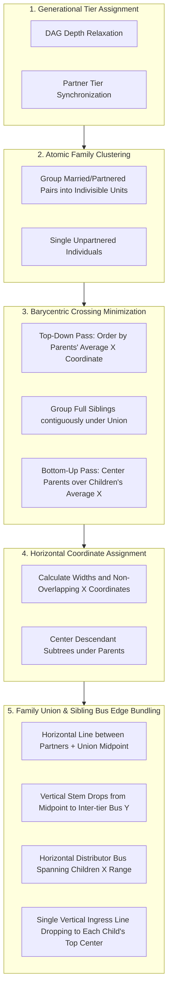

# Birdseye Map Layout Optimization & Family Union Edge Bundling Specification

**Date**: 2026-08-23  
**Status**: Draft for Review  
**Domain**: Family Tree Visual Graph Rendering & Ergonomic Layout

---

## 1. Overview & Objectives

In the **Birdseye Map** interactive canvas (`BirdseyeMapCanvas.tsx`), large family trees currently suffer from two visual issues:
1. **Edge Crossings / Line Tangling**: Individuals within a generational tier are arranged in arbitrary database order without regard to their parents' horizontal positions, causing parent-child connecting lines to cross diagonally across unrelated family branches.
2. **Excess Edge Clutter**: Each child currently receives two separate quadratic bezier curves (one from each parent), resulting in $2 \times N$ overlapping individual lines for $N$ siblings.

This specification details the design for:
1. **Sugiyama-Style Barycentric Tier Ordering with Atomic Family Blocks**: Minimizes edge crossings by ordering siblings and couples based on the center of gravity (barycenter) of their ancestors.
2. **Family Union Junction & Sibling Bus Routing (1 Ingress Edge Per Child)**: Bundles multi-parent connections into a single family union midpoint with a vertical drop stem and horizontal sibling distribution bus, ensuring every child has exactly **one clean incoming line** entering the top of their card.

---

## 2. Architecture & Algorithmic Steps



---

## 3. Detailed Component & Algorithm Design

### 3.1 Step 1: Generational Tier Depth Assignment
- Traverse DAG edges: for every parent-child edge $(P, C)$, enforce $depth(C) \ge depth(P) + 1$.
- For every partner edge $(P_1, P_2)$, synchronize $depth(P_1) = depth(P_2) = \max(depth(P_1), depth(P_2))$.
- Group people by tier depth $T_0, T_1, \dots, T_k$.

### 3.2 Step 2: Atomic Family Unit Formation
- Within each tier $T_i$, partition nodes into **Family Units**:
  - `CoupleUnit`: $[P_1, P_2]$ for individuals sharing a partner relationship.
  - `SingleUnit`: $[P]$ for individuals with no partner in the current tier.
- This guarantees partners always sit directly adjacent to each other without being split by third parties.

### 3.3 Step 3: Barycentric Ordering (Minimizing Crossings)
- For each tier $T_i$ from $i = 1$ to $k$ (top-down):
  - For each family unit $U \in T_i$, calculate its **Parent Barycenter**:
    $$B_{\text{parents}}(U) = \frac{1}{|Parents(U)|} \sum_{p \in Parents(U)} X(p)$$
    If a unit has no parents in the graph, use the average position of its peers or its birth year rank.
  - Sort units in $T_i$ primarily by $B_{\text{parents}}(U)$, keeping full siblings clustered together.
- For each tier $T_i$ from $i = k-1$ down to $0$ (bottom-up):
  - For parent units, calculate **Child Barycenter**:
    $$B_{\text{children}}(U) = \frac{1}{|Children(U)|} \sum_{c \in Children(U)} X(c)$$
  - Adjust relative unit ordering where it resolves parent-child alignment without breaking partner cohesion.

### 3.4 Step 4: Horizontal Coordinate Assignment
- Set node dimensions: $W = 210\text{px}$, $H = 90\text{px}$, horizontal gap $G_X = 50\text{px}$, vertical gap $G_Y = 130\text{px}$.
- For couple units: spacing between partners is $24\text{px}$ (tighter than general gap $G_X$).
- Prevent overlaps: ensure for any two adjacent units $U_a$ and $U_b$, $X(U_b) \ge X(U_a) + Width(U_a) + G_X$.

### 3.5 Step 5: Family Union & Sibling Bus Edge Bundling

Instead of individual curves from each parent:
1. **Parent-Parent Union**:
   - Draw horizontal connection between Partner 1 and Partner 2: from $(P_1.x + W, P_1.y + H/2)$ to $(P_2.x, P_2.y + H/2)$.
   - Calculate Union Point $U_{\text{point}} = (X_{\text{union}}, Y_{\text{union}})$ where $X_{\text{union}} = \frac{(P_1.x + W) + P_2.x}{2}$ and $Y_{\text{union}} = P_1.y + H/2$.
2. **Union Drop Stem**:
   - Single vertical line dropping from $U_{\text{point}}$ down to the inter-tier midline $Y_{\text{bus}} = P_1.y + H + \frac{G_Y}{2}$.
3. **Sibling Distribution Bus**:
   - Let $X_{\min} = \min_{c \in \text{Children}} (c.x + W/2)$ and $X_{\max} = \max_{c \in \text{Children}} (c.x + W/2)$.
   - Draw horizontal bus line from $(X_{\min}, Y_{\text{bus}})$ to $(X_{\max}, Y_{\text{bus}})$, connected to the drop stem at $X_{\text{union}}$.
4. **Single Ingress Line to Child**:
   - From $(c.x + W/2, Y_{\text{bus}})$, drop a single vertical line down to the top center of child card $(c.x + W/2, c.y)$.
5. **Single-Parent Families**:
   - For children of a single parent (without a second partner in the graph), drop the stem directly from the parent's bottom center $(P.x + W/2, P.y + H)$ to $Y_{\text{bus}}$, distributing to children in the exact same single-ingress manner.

---

## 4. Visual Comparison

### Before (Spiderweb Overlap)
```
  [Father] -------- [Mother]
     \    \        /    /
      \    \------/    /
       \  / \    / \  /    <-- Multi-crossing curves
        \/   \  /   \/
     [Child 1]  [Child 2]
```

### After (Family Union Bus)
```
  [Father] === [Mother]
          |            <-- Single union drop stem
     -----+-----       <-- Clean horizontal sibling bus
     |         |       <-- Exactly 1 ingress per child
 [Child 1] [Child 2]
```

---

## 5. Accessibility & Ergonomics
- **Color Contrast**: SVG connector lines rendered in bold `#64748b` (slate-500) with high-contrast active state `#d97706` (amber-600) and focus highlight `#0f172a` (slate-900).
- **Line Thickness**: Crisp 2.5px stroke width with smooth rounded line-joins (`stroke-linejoin="round"`, `stroke-linecap="round"`).
- **Zero Layout Lag**: Deterministic $O(V \log V)$ computation runs inside React `useMemo`, ensuring instantaneous pan/zoom responsiveness up to hundreds of nodes.

---

## 6. Verification & Test Plan

1. **Automated Vitest Tests (`frontend/tests/BirdseyeMapCanvas.test.tsx`)**:
   - Verify nodes in the same family are ordered contiguously under their parents.
   - Verify single-ingress edge generation: verify children have exactly one parent-child connection path entering from above.
   - Verify partner marriage line and midpoint calculation.
   - Verify single-parent family branch rendering.
   - Verify multi-generation tree (3+ tiers) maintains zero crossing for standard pedigrees.
   - Verify `vitest-axe` automated accessibility audit.
2. **Frontend Monorepo Verification**:
   - `npm run lint`
   - `npm run build`
   - `npm test`
