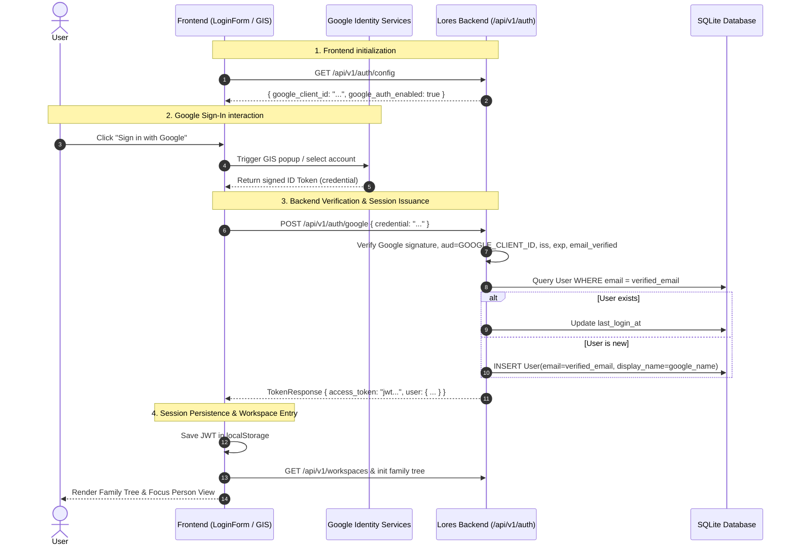

# Google SSO Authentication Design Specification

## 1. Overview & Context

Lores currently supports passwordless login via a 6-digit numeric OTP delivered by email (SMTP / Resend with console fallback). While secure and password-free, email delivery incurs recurring email service costs (or rate limit constraints) and friction for users who already use Google accounts.

This specification details the addition of **Google Single Sign-On (SSO)** using Google Identity Services (GIS) ID tokens. Google SSO will coexist with the existing email OTP flow, automatically linking existing accounts by email address, creating new accounts on first login, and gracefully disabling if Google credentials are not configured.

---

## 2. Goals & Non-Goals

### Goals
- **Dual Authentication**: Support both Google SSO (1-click sign in) and Email OTP seamlessly on the login page.
- **Account Unification**: Automatically match users by verified email address so users retain their trees, permissions, lore notes, and audit logs regardless of whether they log in via Google or Email OTP.
- **Graceful Fallback & Configuration**: Enable Google SSO if `GOOGLE_CLIENT_ID` is configured in `.env`; if absent, gracefully hide/disable Google SSO without errors or application degradation.
- **Accessibility & Compliance**: Zero WCAG 2.1 AAA accessibility violations, full keyboard navigation, high contrast support, and mobile responsiveness.
- **Security & Token Integrity**: Strict backend cryptographic verification of Google ID tokens (audience, issuer, expiration, email verification).
- **Comprehensive Automated Testing**: 100% test coverage with offline mocks for backend and frontend tests.

### Non-Goals
- Supporting other OAuth providers (Apple, GitHub, Microsoft) in this iteration (can follow this pattern later).
- Replacing or deprecating the Email OTP flow.
- Requiring Google API scopes beyond basic profile/email identity.

---

## 3. Architecture & Data Flow



---

## 4. Backend Implementation Details

### 4.1 Configuration (`app/config.py`)
Add the following optional setting to `Settings`:
- `GOOGLE_CLIENT_ID: str | None = None`
- Allow loading from environment variable or `backend/.env`.

### 4.2 Auth Service (`app/services/auth_service.py`)
Implement `verify_google_id_token(db: Session, id_token: str) -> tuple[User, str]`:
1. Check if `settings.GOOGLE_CLIENT_ID` is configured. If not, raise `ValueError("Google authentication is not configured on this server")`.
2. Verify the ID token:
   - Use `google.oauth2.id_token.verify_oauth2_token(id_token, requests.Request(), settings.GOOGLE_CLIENT_ID)` (or lightweight cryptographic validation with `google-auth` library).
   - Ensure `id_info["aud"] == settings.GOOGLE_CLIENT_ID`.
   - Ensure `id_info["iss"] in ["accounts.google.com", "https://accounts.google.com"]`.
   - Ensure `id_info.get("email_verified") is True`.
3. Normalize email: `clean_email = id_info["email"].lower().strip()`.
4. User matching & provisioning:
   - Search for existing `User` where `User.email == clean_email`.
   - If not found, create new `User(email=clean_email, display_name=id_info.get("name") or clean_email.split("@")[0].capitalize())`.
   - Update `user.last_login_at = datetime.now(UTC)`.
   - Commit/flush database session.
5. Create and return `create_access_token({"sub": str(user.id), "email": user.email})`.

### 4.3 Schemas (`app/schemas/auth.py`)
Add:
- `GoogleAuthRequest`:
  ```python
  class GoogleAuthRequest(BaseModel):
      credential: str
  ```
- `AuthConfigResponse`:
  ```python
  class AuthConfigResponse(BaseModel):
      google_client_id: str | None = None
      google_auth_enabled: bool = False
  ```

### 4.4 API Endpoints (`app/api/v1/auth.py`)
Add endpoints:
- `GET /api/v1/auth/config` -> returns `AuthConfigResponse`
- `POST /api/v1/auth/google` -> accepts `GoogleAuthRequest`, verifies via `auth_service.verify_google_id_token`, returns `TokenResponse`.

---

## 5. Frontend Implementation Details

### 5.1 API Client (`frontend/src/lib/api.ts`)
Add to `api.auth`:
- `getConfig(): Promise<AuthConfigResponse>`
- `loginWithGoogle(credential: string): Promise<TokenResponse>`

### 5.2 Login Component (`frontend/src/components/auth/LoginForm.tsx`)
- On component mount, call `api.auth.getConfig()` to check if Google Auth is enabled and retrieve `google_client_id`.
- If Google Auth is enabled:
  - Dynamically load the Google Identity Services script (`https://accounts.google.com/gsi/client`) if not already present.
  - Render an accessible "Sign in with Google" button.
  - Initialize `google.accounts.id.initialize({ client_id, callback })`.
  - In the callback, post `response.credential` to `api.auth.loginWithGoogle(...)` and notify the parent component or update session storage and reload user data.
  - Render a clear visual divider: `──────── or continue with email ────────`.
- Retain the existing email OTP form below the divider.
- Handle loading and error states with clear alert messaging.

### 5.3 App Orchestration (`frontend/src/App.tsx`)
- On successful Google login, update `currentUser` and load workspaces just like the OTP verification flow.

---

## 6. Accessibility (WCAG 2.1 AAA) & Usability

1. **Large Touch/Click Targets**: Google Sign-In button conforms to $\ge 44 \times 44\text{px}$ touch targets.
2. **Clear Typography & Contrast**: Text contrast ratios $\ge 7:1$ for normal text, high contrast theme styling compatible.
3. **Screen Reader Support**: Meaningful `aria-label` and `role="alert"` for authentication errors.
4. **Keyboard Operability**: Full tab index traversal and activation via `Enter` or `Space`.

---

## 7. Verification & Testing Plan

### 7.1 Backend Automated Tests (`backend/tests/test_auth.py` & `test_google_auth.py`)
- `test_auth_config_endpoint`: verifies `/api/v1/auth/config` returns expected flags when Google client ID is set or omitted.
- `test_google_auth_success_new_user`: mock Google ID token validation, verify new user created and JWT returned.
- `test_google_auth_success_existing_user`: mock Google ID token for existing user, verify same user record matched and returned.
- `test_google_auth_unverified_email_fails`: verify 400 Bad Request if `email_verified` is false.
- `test_google_auth_invalid_token_fails`: verify 400 Bad Request on forged/invalid signature.
- `test_google_auth_disabled_fails`: verify 400 Bad Request when server has no `GOOGLE_CLIENT_ID` configured.

### 7.2 Frontend Automated Tests (`frontend/tests/LoginForm.test.tsx` & `a11y-components.test.tsx`)
- `test_login_form_renders_google_button_when_enabled`: mock config returning enabled, verify Google button rendered.
- `test_login_form_hides_google_button_when_disabled`: mock config returning disabled, verify only OTP form rendered.
- `test_login_form_google_auth_callback`: verify token submission and session storage.
- `test_login_form_passes_axe_accessibility_audit`: zero WCAG violations with `vitest-axe`.

### 7.3 Full Verification Pipeline
Run complete repository verification before completion:
- `cd backend && ruff check . && ruff format --check . && mypy app && pytest -v`
- `cd frontend && npm run lint && npm run build && npm test && npm run test:e2e:a11y`
