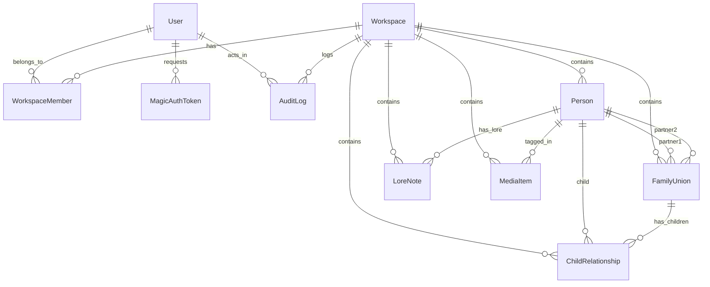

# Lores: Architecture & Technical Design Specification

**Document Version:** 1.0.0  
**Date:** 2026-08-23  
**Status:** Ready for Review  
**Target System:** Lores (Accessible, Multi-Tenant Family Tree Builder)

---

## 1. Executive Summary & Vision

### 1.1 Product Vision
**Lores** is an accessible, multi-tenant web application engineered specifically for families to record, preserve, and explore their lineage and stories. The primary contributors are older, less technically conversant relatives who hold invaluable family lore. 

Unlike traditional genealogy software that overwhelms users with dense charts, microscopic fonts, and confusing genealogical jargon, Lores prioritizes **simplicity, psychological safety, and radical accessibility**.

### 1.2 Core Architectural Principles
1. **Senior-First UX**: Large typography, high-contrast UI (WCAG 2.1 AAA target), zero genealogical jargon, low cognitive load, and explicit visual safety nets.
2. **Strict Multi-Tenancy**: 1:1 mapping between Workspace and Family Tree with isolated data boundaries and robust Role-Based Access Control (RBAC).
3. **Passwordless Security**: Email Magic Links and One-Time Passcodes (OTP) eliminating password fatigue while guaranteeing verified identity.
4. **Psychological Safety & Concurrency**: Granular field-level merging, immutable append-only audit logging, 1-click version rollback, and a 30-day Family Trash Can.
5. **Robust Data Integrity**: Union-centric graph data model aligned with GEDCOM 7.0, cycle detection on relationship mutations, and sub-millisecond indexed 1-hop traversal.

---

## 2. User Personas & Experience Architecture

### 2.1 Target Personas
- **The Storykeeper (Grandparent / Senior Contributor):** Non-technical, accesses via tablet/desktop, needs large readable text, fears "breaking the tree," excels when prompted with guided conversational questions.
- **The Family Administrator (Parent / Tech-Savvy Relative):** Sets up the workspace, sends email invites to relatives, manages roles, and organizes media/lore.
- **The Collaborator (Cousin / Sibling):** Contributes dates, anecdotes, corrections, and photographs.
- **The Viewer (Younger Relatives / Distant Kin):** Explores the tree and reads family lore in a clean read-only mode.

### 2.2 Core Views & Navigation Modes

```
+-----------------------------------------------------------------------------------+
|  LORES  [ Workspace: The Miller Family v ]                 [ Search ]  [ User v ] |
+-----------------------------------------------------------------------------------+
|  [ Focus View (Active) ]   [ Guided Interview ]   [ Bird's-Eye Map ]  [ Activity ]|
+-----------------------------------------------------------------------------------+
|                                                                                   |
|                               +------------------+                                |
|                               | PARENTS          |                                |
|                               | [ Arthur Miller] |                                |
|                               | [ Clara Higgins ]|                                |
|                               +--------+---------+                                |
|                                        |                                          |
|                                        v                                          |
|       +-----------------+     +------------------+     +------------------+       |
|       | SIBLINGS        | <-> | FOCUS PERSON     | <-> | PARTNERS         |       |
|       | [ Robert Miller]|     | MARGARET MILLER  |     | [ George Vance ] |       |
|       | [ David Miller ]|     | (1924 - 2008)    |     +--------+---------+       |
|       +-----------------+     +--------+---------+              |                 |
|                                        |                        |                 |
|                                        +----------+-------------+                 |
|                                                   |                               |
|                                                   v                               |
|                                        +------------------+                       |
|                                        | CHILDREN         |                       |
|                                        | [ Ronald Vance ] |                       |
|                                        | [ Eleanor Vance] |                       |
|                                        +------------------+                       |
|                                                                                   |
+-----------------------------------------------------------------------------------+
| Breadcrumb History: Home > Arthur Miller > [Margaret Miller]                      |
+-----------------------------------------------------------------------------------+
```

#### View 1: Focus-Person Editor (Default Primary View)
- Centers on a single active individual with immediate 1-hop relatives clearly positioned:
  - **Top:** Parents (with "+ Add Parent" action).
  - **Left:** Siblings (with "+ Add Sibling" action).
  - **Right:** Spouses/Partners (with "+ Add Partner" action).
  - **Bottom:** Children (with "+ Add Child" action).
- Clicking any relative smoothly shifts the center of focus to that person.
- Breadcrumb trail at the bottom allows instant one-click backtrack.

#### View 2: Guided Interview Assistant (Conversational Flow)
- Step-by-step oral history and data entry modal (e.g. *"Who are Margaret's parents?", "Where was Margaret born?"*).
- Allows elderly users to dictate or type naturally without interacting with graph controls.

#### View 3: Bird's-Eye Pedigree Map (Read-Only Tapestry)
- Zoomable, pannable multi-generation tree view rendered via SVG.
- Ideal for family reunions, overview exploration, and exporting PDF/printable family charts.

#### View 4: Activity & History Drawer (Audit Trail + 1-Click Restore)
- Accessible from any person card or global workspace menu.
- Displays human-readable timeline (e.g., *"Aunt Sarah updated birthplace to Boston on Aug 12"*).
- Every card has a *"Revert to this version"* action and a 30-day *"Family Trash Can"* for restored deletions.

---

## 3. Multi-Tenancy, Authentication & RBAC

### 3.1 Tenancy Boundary
- **1 Workspace = 1 Family Tree**.
- Strict workspace-level data isolation. Every query to `Person`, `FamilyUnion`, `ChildRelationship`, `LoreNote`, `MediaItem`, and `AuditLog` MUST filter by `workspace_id`.

### 3.2 Role-Based Access Control (RBAC) Matrix

| Role | Scope | Permissions |
| :--- | :--- | :--- |
| **Super Admin** | System-wide | Manage users, view system metrics, cross-workspace health checks. |
| **Family Admin** | Workspace | Workspace settings, invite/remove members, assign roles, purge trash, export GEDCOM. |
| **Collaborator** | Workspace | Add/edit/delete people, unions, children, lore, media, view full audit logs. |
| **Viewer** | Workspace | Read-only access to tree and lore; living person private details masked. |

### 3.3 Living Person Privacy Guard (GDPR / Genealogical Standard)
- For users with the `Viewer` role or public read links:
  - Any `Person` where `is_living == True` has birth dates, death dates, private lore notes, and contact details redacted (displayed as *"Living Relative"* unless granted Collaborator/Admin rights).

### 3.4 Passwordless Authentication Flow
1. Contributor enters email address on the login/invitation page.
2. Backend generates a cryptographically secure 6-digit numeric OTP and a signed 1-click magic link token (valid for 15 minutes).
3. Email dispatched via transactional email service (or printed to terminal/mock in dev).
4. Contributor clicks link or types OTP -> receives HTTP-only Secure JWT Session Token.

---

## 4. Domain Data Model & Database Schema



### 4.1 Relational Schema Definitions

#### `users`
- `id` (UUID, PK)
- `email` (VARCHAR 255, Unique, Indexed)
- `display_name` (VARCHAR 100, Not Null)
- `is_superadmin` (BOOLEAN, Default False)
- `created_at` (TIMESTAMP UTC)
- `last_login_at` (TIMESTAMP UTC, Nullable)

#### `magic_auth_tokens`
- `id` (UUID, PK)
- `email` (VARCHAR 255, Indexed)
- `code_hash` (VARCHAR 255, Not Null)
- `token_hash` (VARCHAR 255, Unique, Not Null)
- `expires_at` (TIMESTAMP UTC, Not Null)
- `used_at` (TIMESTAMP UTC, Nullable)
- `created_at` (TIMESTAMP UTC)

#### `workspaces`
- `id` (UUID, PK)
- `name` (VARCHAR 150, Not Null)
- `slug` (VARCHAR 150, Unique, Indexed)
- `description` (TEXT, Nullable)
- `created_by_user_id` (UUID, FK -> `users.id`)
- `created_at` (TIMESTAMP UTC)
- `updated_at` (TIMESTAMP UTC)

#### `workspace_members`
- `id` (UUID, PK)
- `workspace_id` (UUID, FK -> `workspaces.id`, Indexed)
- `user_id` (UUID, FK -> `users.id`, Indexed)
- `role` (ENUM: `admin`, `collaborator`, `viewer`)
- `invited_by_user_id` (UUID, FK -> `users.id`, Nullable)
- `joined_at` (TIMESTAMP UTC)
- *Constraint:* Unique `(workspace_id, user_id)`

#### `people`
- `id` (UUID, PK)
- `workspace_id` (UUID, FK -> `workspaces.id`, Indexed)
- `first_name` (VARCHAR 100, Not Null)
- `last_name` (VARCHAR 100, Not Null)
- `maiden_name` (VARCHAR 100, Nullable)
- `gender` (ENUM: `male`, `female`, `other`, `unknown`, Default `unknown`)
- `is_living` (BOOLEAN, Default True)
- `birth_date` (VARCHAR 30, Nullable) -- ISO format or freeform year (e.g. "1942", "circa 1940")
- `birth_date_qualifier` (ENUM: `exact`, `estimated`, `calculated`, `before`, `after`, `about`, Default `exact`)
- `birth_place` (VARCHAR 255, Nullable)
- `death_date` (VARCHAR 30, Nullable)
- `death_date_qualifier` (ENUM: `exact`, `estimated`, `calculated`, `before`, `after`, `about`, Default `exact`)
- `death_place` (VARCHAR 255, Nullable)
- `biography` (TEXT, Nullable)
- `avatar_url` (VARCHAR 500, Nullable)
- `is_deleted` (BOOLEAN, Default False, Indexed)
- `deleted_at` (TIMESTAMP UTC, Nullable)
- `deleted_by_id` (UUID, FK -> `users.id`, Nullable)
- `created_at` (TIMESTAMP UTC)
- `updated_at` (TIMESTAMP UTC)
- *Indexes:* `(workspace_id, is_deleted)`, `(workspace_id, last_name, first_name)`

#### `family_unions`
- `id` (UUID, PK)
- `workspace_id` (UUID, FK -> `workspaces.id`, Indexed)
- `partner1_id` (UUID, FK -> `people.id`, Nullable, Indexed)
- `partner2_id` (UUID, FK -> `people.id`, Nullable, Indexed)
- `union_type` (ENUM: `marriage`, `civil_union`, `unmarried_partnership`, `unknown`, Default `marriage`)
- `is_current` (BOOLEAN, Default True)
- `start_date` (VARCHAR 30, Nullable)
- `end_date` (VARCHAR 30, Nullable)
- `notes` (TEXT, Nullable)
- `is_deleted` (BOOLEAN, Default False, Indexed)
- `deleted_at` (TIMESTAMP UTC, Nullable)
- `created_at` (TIMESTAMP UTC)
- `updated_at` (TIMESTAMP UTC)
- *Indexes:* `(workspace_id, partner1_id)`, `(workspace_id, partner2_id)`

#### `child_relationships`
- `id` (UUID, PK)
- `workspace_id` (UUID, FK -> `workspaces.id`, Indexed)
- `union_id` (UUID, FK -> `family_unions.id`, Indexed)
- `child_id` (UUID, FK -> `people.id`, Indexed)
- `relationship_type` (ENUM: `biological`, `adopted`, `foster`, `step`, Default `biological`)
- `is_deleted` (BOOLEAN, Default False, Indexed)
- `deleted_at` (TIMESTAMP UTC, Nullable)
- `created_at` (TIMESTAMP UTC)
- `updated_at` (TIMESTAMP UTC)
- *Indexes:* `(workspace_id, union_id)`, `(workspace_id, child_id)`

#### `lore_notes`
- `id` (UUID, PK)
- `workspace_id` (UUID, FK -> `workspaces.id`, Indexed)
- `person_id` (UUID, FK -> `people.id`, Indexed)
- `title` (VARCHAR 200, Not Null)
- `content` (TEXT, Not Null)
- `author_id` (UUID, FK -> `users.id`, Indexed)
- `event_year` (INTEGER, Nullable)
- `tags` (JSONB, Default '[]')
- `is_deleted` (BOOLEAN, Default False)
- `deleted_at` (TIMESTAMP UTC, Nullable)
- `created_at` (TIMESTAMP UTC)
- `updated_at` (TIMESTAMP UTC)

#### `media_items`
- `id` (UUID, PK)
- `workspace_id` (UUID, FK -> `workspaces.id`, Indexed)
- `person_id` (UUID, FK -> `people.id`, Indexed)
- `file_url` (VARCHAR 500, Not Null)
- `file_name` (VARCHAR 255, Not Null)
- `mime_type` (VARCHAR 100, Not Null)
- `caption` (TEXT, Nullable)
- `taken_date` (VARCHAR 30, Nullable)
- `uploaded_by_id` (UUID, FK -> `users.id`)
- `is_deleted` (BOOLEAN, Default False)
- `created_at` (TIMESTAMP UTC)

#### `audit_logs`
- `id` (UUID, PK)
- `workspace_id` (UUID, FK -> `workspaces.id`, Indexed)
- `actor_id` (UUID, FK -> `users.id`, Nullable, Indexed)
- `actor_name` (VARCHAR 100, Not Null)
- `actor_email` (VARCHAR 255, Not Null)
- `entity_type` (VARCHAR 50, Not Null) -- `Person`, `FamilyUnion`, `ChildRelationship`, `LoreNote`, `Member`
- `entity_id` (UUID, Not Null, Indexed)
- `action` (ENUM: `CREATE`, `UPDATE`, `SOFT_DELETE`, `RESTORE`, `MERGE`, `ROLE_CHANGE`)
- `changes` (JSONB, Not Null) -- Diff: `{"birth_year": {"old": 1942, "new": 1944}}`
- `ip_address` (VARCHAR 45, Nullable)
- `created_at` (TIMESTAMP UTC, Indexed)

---

## 5. Core Algorithms & Business Logic

### 5.1 Cycle Detection Algorithm
Before adding a child relationship (`ChildRelationship(union_id, child_id)`), the backend executes a cycle prevention check:
1. Identify parents in the target union (`partner1_id`, `partner2_id`).
2. Run a Depth-First Search (DFS) / Recursive query starting from `child_id` down all descendants.
3. If any parent in the union exists within the descendant set of `child_id`, reject with HTTP 400 (`"CycleDetectedError: A person cannot be their own ancestor"`).

### 5.2 1-Hop Focus Neighborhood Query
For a given `person_id` in a `workspace_id`:
1. **Parents:** Query `child_relationships` where `child_id = person_id` -> join `family_unions` -> fetch `partner1` and `partner2`.
2. **Partners:** Query `family_unions` where `partner1_id = person_id` OR `partner2_id = person_id`.
3. **Children:** For all unions where person is partner -> query `child_relationships` -> fetch `child` person records.
4. **Siblings:** For all unions where person is a child -> query all other `child_relationships` for those unions -> fetch sibling person records.
5. Filter out all `is_deleted = True` records.
6. Execution time: <1ms via indexed foreign keys.

### 5.3 Optimistic Field-Level Concurrency & Conflict Detection
1. When a client fetches a person, it receives a version hash or `updated_at` timestamp per field.
2. On update, client sends mutated fields with their base timestamp.
3. If the backend detects that another user has updated the *same specific field* since the base timestamp, the server returns an HTTP 409 Conflict with both values:
   ```json
   {
     "conflict": true,
     "field": "birth_date",
     "current_value": "1942-04-12",
     "updated_by": "Uncle Dave",
     "updated_at": "2026-08-23T07:15:00Z"
   }
   ```
4. Frontend displays a gentle side-by-side resolution dialog for the contributor.

### 5.4 30-Day Trash & 1-Click Restore
1. Soft deletion marks `is_deleted = True` and sets `deleted_at = now()`, `deleted_by_id = actor.id`.
2. Deleting a `Person` automatically soft-deletes associated `child_relationships` and `family_unions` in a single transaction.
3. Restoring a `Person` reactivates associated relationships atomically and logs a `RESTORE` audit record.

---

## 6. API Specification & REST Contracts

All endpoints are prefixed with `/api/v1`.

### 6.1 Authentication (`/api/v1/auth`)
- `POST /auth/request-otp`: Request 6-digit OTP and Magic Link via email.
- `POST /auth/verify-otp`: Validate 6-digit OTP -> return JWT session cookie.
- `GET /auth/verify-magic-link`: Validate magic link token -> redirect with session cookie.
- `GET /auth/me`: Get current authenticated user details and workspace memberships.
- `POST /auth/logout`: Invalidate session.

### 6.2 Workspaces & Members (`/api/v1/workspaces`)
- `GET /workspaces`: List all workspaces current user belongs to.
- `POST /workspaces`: Create a new workspace and assign caller as `admin`.
- `GET /workspaces/{id}`: Get workspace metadata.
- `PATCH /workspaces/{id}`: Update workspace name/description (Admin only).
- `GET /workspaces/{id}/members`: List workspace members and roles.
- `POST /workspaces/{id}/invites`: Send email invitation to join workspace with role.
- `PATCH /workspaces/{id}/members/{user_id}`: Update member role (Admin only).
- `DELETE /workspaces/{id}/members/{user_id}`: Remove member (Admin only).

### 6.3 Tree & Neighborhood (`/api/v1/workspaces/{id}/tree`)
- `GET /tree/focus/{person_id}`: Fetch complete 1-hop focus neighborhood (person, parents, partners, children, siblings).
- `POST /tree/add-relative`: Atomic helper endpoint to create a person and link as parent/child/partner/sibling in one transaction.
- `GET /tree/overview`: Fetch compact graph representation of the entire workspace tree for the Bird's-Eye Canvas.

### 6.4 People Management (`/api/v1/workspaces/{id}/people`)
- `GET /people`: Search / list people in the workspace with pagination and filters.
- `POST /people`: Create a new person record.
- `GET /people/{person_id}`: Fetch detailed profile, vital events, lore, and media.
- `PATCH /people/{person_id}`: Update profile fields with optimistic concurrency check.
- `DELETE /people/{person_id}`: Soft-delete person and related links to Family Trash.

### 6.5 Lore & Media (`/api/v1/workspaces/{id}/lore`)
- `GET /people/{person_id}/lore`: List stories and anecdotes for a person.
- `POST /people/{person_id}/lore`: Add a new lore story.
- `PATCH /lore/{lore_id}`: Edit lore story.
- `DELETE /lore/{lore_id}`: Soft-delete lore story.
- `POST /people/{person_id}/media`: Upload photo or document attachment.

### 6.6 Trash & Audit (`/api/v1/workspaces/{id}/trash` & `/audit`)
- `GET /trash`: List all soft-deleted items (people, lore, media) within last 30 days.
- `POST /trash/restore/{entity_type}/{entity_id}`: Restore soft-deleted entity and associations.
- `DELETE /trash/empty`: Permanently purge items in trash (Admin only).
- `GET /audit`: Workspace activity feed with pagination.
- `GET /audit/person/{person_id}`: History of changes for a specific person.
- `POST /audit/revert/{audit_id}`: Revert a specific historical mutation.

### 6.7 Data Import & Export (`/api/v1/workspaces/{id}/export`)
- `GET /export/gedcom`: Export workspace family tree as standard GEDCOM 7.0 file.
- `POST /import/gedcom`: Import external GEDCOM file into workspace.
- `GET /export/json`: Complete JSON backup of all records, lore, and audit history.

---

## 7. Frontend Component Hierarchy & State Design

```
src/
├── app/
│   ├── routes.tsx
│   ├── App.tsx
│   └── main.tsx
├── components/
│   ├── common/
│   │   ├── Button.tsx            # Large click targets, high contrast
│   │   ├── Dialog.tsx            # Radix modal with accessible focus trapping
│   │   ├── FormField.tsx         # Clear labels, large inputs
│   │   └── Toast.tsx
│   ├── layout/
│   │   ├── Header.tsx            # Workspace switcher & user menu
│   │   ├── NavigationBar.tsx     # Large tab buttons: Focus / Interview / Map / Activity
│   │   └── BreadcrumbBar.tsx
│   ├── tree/
│   │   ├── FocusPersonView.tsx   # Primary 1-hop interactive hub
│   │   ├── PersonCard.tsx        # High-contrast, friendly card with badge indicators
│   │   ├── AddRelativeButton.tsx # Contextual "+ Add Parent / Child / Partner" triggers
│   │   ├── EditPersonDrawer.tsx  # Slide-over edit form with history tab
│   │   └── ConflictDialog.tsx    # Simple side-by-side resolution UI
│   ├── interview/
│   │   └── GuidedInterviewModal.tsx # Step-by-step conversational story entry
│   ├── map/
│   │   └── BirdseyeMapCanvas.tsx # Smooth SVG multi-generation pan/zoom
│   ├── history/
│   │   ├── ActivityFeed.tsx      # Global workspace activity log
│   │   └── TrashCanModal.tsx     # Family Trash recovery bin
│   └── auth/
│       ├── LoginView.tsx         # Passwordless email input
│       └── VerifyOtpView.tsx     # 6-digit large OTP entry
└── lib/
    ├── api/                      # Typed API client with SWR / TanStack Query
    ├── accessibility/            # Contrast checkers & keyboard listeners
    └── types/                    # Shared TypeScript interfaces
```

---

## 8. Testing Strategy & Quality Assurance Gate

### 8.1 Backend Test Discipline (Pytest + Factory-Boy)
- **Unit Tests:**
  - Cycle detection algorithms with multi-generation test graphs.
  - 1-hop neighborhood query accuracy with complex blended families (half-siblings, step-parents, second marriages).
  - Living person privacy masking against Viewer vs Collaborator roles.
  - Optimistic concurrency conflict detection.
  - Soft-delete cascade and 1-click atomic restore.
  - Magic link & OTP generation, expiry, and replay-attack rejection.
- **Integration Tests:**
  - Full multi-tenant isolation verification (User A cannot access Workspace B without membership).
  - Complete REST lifecycle tests for all endpoints.

### 8.2 Quality Gate (Pre-Commit Automation)
No commit shall be accepted without passing:
1. `pytest`: 100% tests passing with >90% coverage on core domains.
2. `ruff check .`: Strict linting with zero warnings.
3. `ruff format --check .`: Code formatting validation.
4. `mypy`: Strict static type checking on backend.
5. `tsc --noEmit`: Strict TypeScript compilation on frontend.
