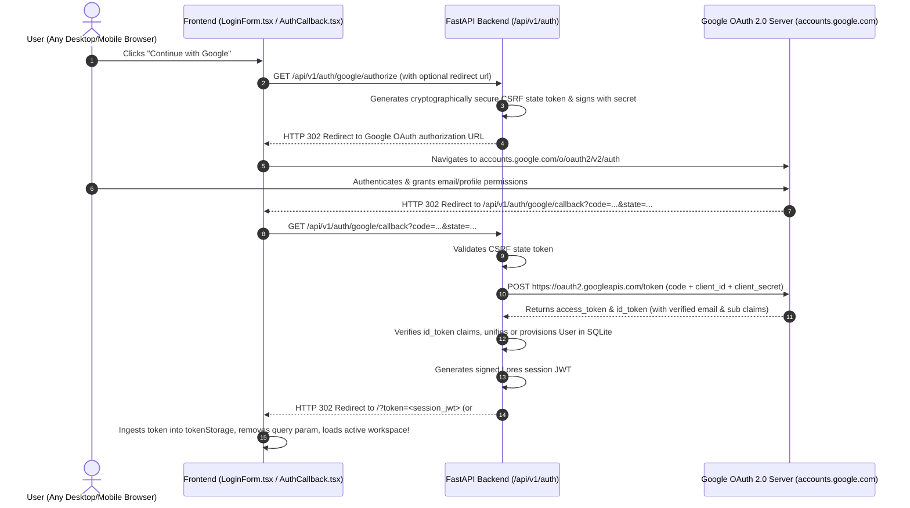

# Design Specification: Universal Google OAuth 2.0 Redirect Flow

**Document ID**: `2026-08-25-google-oauth-redirect-flow-design`  
**Status**: Draft for Review  
**Target Date**: 2026-08-25  
**Author**: Antigravity Pair Programmer & Prashanth Mohan  

---

## 1. Overview & Problem Statement

### 1.1 Problem Statement
The initial Google SSO implementation used Google Identity Services (GIS) client-side JavaScript (`https://accounts.google.com/gsi/client`) and the One-Tap prompt API (`google.accounts.id.prompt()`). On privacy-hardened mobile browsers (particularly Firefox Mobile with Enhanced Tracking Protection, Safari iOS with Intelligent Tracking Prevention, and Brave with Shields), third-party script blocking and iframe storage partitioning prevent the script from loading or suppress the One-Tap UI entirely, producing:
> *"Google Sign In could not be loaded. Please disable content blockers or continue with email"*

### 1.2 Objective
Upgrade the Google Single Sign-On implementation to the **Universal Server-Side OAuth 2.0 Authorization Code Redirect Flow**. This standard OAuth flow:
1. Eliminates all third-party external JavaScript dependencies in the frontend browser.
2. Is 100% immune to Firefox Enhanced Tracking Protection (ETP), Safari Intelligent Tracking Prevention (ITP), Brave Shields, uBlock Origin, and DNS-level ad blockers.
3. Works flawlessly across all desktop and mobile browsers (Firefox Mobile, Safari iOS, Chrome, Edge, Samsung Internet) and in-app web views.
4. Seamlessly preserves dual-authentication (coexisting with Email OTP) and existing account unification by verified email.

---

## 2. System Architecture & Authentication Flow

### 2.1 Sequence Diagram



---

## 3. Detailed Component Specifications

### 3.1 Backend Configuration (`backend/app/config.py`)
Add `GOOGLE_CLIENT_SECRET`:
```python
GOOGLE_CLIENT_ID: str | None = None
GOOGLE_CLIENT_SECRET: str | None = None
```
Feature enablement rule: `google_auth_enabled` is `True` when both `GOOGLE_CLIENT_ID` and `GOOGLE_CLIENT_SECRET` (or `GOOGLE_CLIENT_ID` alone if fallback allowed) are configured.

### 3.2 Backend Endpoints (`backend/app/api/v1/auth.py`)

1. **`GET /api/v1/auth/config`**:
   Returns:
   ```json
   {
     "google_client_id": "616799374664-...",
     "google_auth_enabled": true
   }
   ```

2. **`GET /api/v1/auth/google/authorize`**:
   - Query parameters: optional `redirect_uri` or frontend origin fallback.
   - Generates state: `state_token = jwt.encode({"nonce": secrets.token_urlsafe(16), "exp": time() + 300}, JWT_SECRET)`.
   - Constructs Google OAuth URL:
     ```
     https://accounts.google.com/o/oauth2/v2/auth?
       client_id={GOOGLE_CLIENT_ID}&
       redirect_uri={backend_callback_url}&
       response_type=code&
       scope=openid%20email%20profile&
       state={state_token}&
       prompt=select_account&
       access_type=online
     ```
   - Returns `HTTP 302 Found` redirecting the browser directly to the Google URL.

3. **`GET /api/v1/auth/google/callback`**:
   - Query parameters: `code: str`, `state: str`, optional `error: str`.
   - Validates `state` token against `JWT_SECRET` (rejects if expired or tampered with).
   - Makes backend server-to-server POST request via `httpx.AsyncClient` to `https://oauth2.googleapis.com/token`:
     ```json
     {
       "code": code,
       "client_id": settings.GOOGLE_CLIENT_ID,
       "client_secret": settings.GOOGLE_CLIENT_SECRET,
       "redirect_uri": callback_url,
       "grant_type": "authorization_code"
     }
     ```
   - Decodes and validates returned `id_token` (ensuring `email_verified == True`).
   - Resolves user via `auth_service.get_or_create_google_user(db, email, display_name)`.
   - Generates Lores access token: `session_token = create_access_token(...)`.
   - Redirects user back to frontend: `HTTP 302 Found` to `{frontend_url}/?token={session_token}`.

### 3.3 Frontend Client & UI (`frontend/`)

1. **`LoginForm.tsx`**:
   - No external `<script src="https://accounts.google.com/gsi/client">` tag or `window.google` polling.
   - The **"Continue with Google"** button renders as an accessible link (`<a>` or button triggering navigation) pointing to `${API_BASE}/auth/google/authorize` (e.g. `/api/v1/auth/google/authorize`).
   - Accessible keyboard target ($\ge 44 \times 44\text{px}$), high-contrast styling, Google SVG icon.
   - Shows or hides dynamically based on `authConfig.google_auth_enabled`.

2. **`App.tsx` (Token Ingestion on Return)**:
   - On initial page mount, check `window.location.search` or `window.location.hash` for `?token=...` or `#token=...`.
   - If found:
     - Save token into `tokenStorage.set(token)`.
     - Clean up URL bar without page reload via `window.history.replaceState({}, document.title, window.location.pathname)`.
     - Fetch current user (`api.auth.getMe()`) and initialize workspace.

---

## 4. Security & Privacy Guarantees

1. **Anti-CSRF Protection**:
   The `state` parameter is cryptographically signed using `JWT_SECRET` and has a 5-minute TTL to prevent authorization code injection or replay attacks.
2. **Server-Side Token Exchange**:
   Google `client_secret` is never exposed to the client browser.
3. **Verified Email Invariant**:
   Only Google accounts with `email_verified: true` in the signed OpenID ID token are accepted for account matching.
4. **Zero Third-Party Client Tracking**:
   Eliminates all third-party analytics/scripts loaded from `accounts.google.com` inside the Lores web app DOM.

---

## 5. Backward Compatibility & Fallback

- **Email OTP**: Continues to work identically without any modification.
- **Unconfigured Mode**: If `GOOGLE_CLIENT_ID` or `GOOGLE_CLIENT_SECRET` is unset, `google_auth_enabled` returns `False`, and `LoginForm` displays the pure Email OTP form.
- **Client ID Token Endpoint**: The existing `POST /api/v1/auth/google` endpoint remains intact to support programmatic client-credential exchange if needed.

---

## 6. Verification Plan

### Automated Tests
1. **Backend Tests (`backend/tests/test_google_oauth_redirect.py`)**:
   - Test `GET /api/v1/auth/google/authorize` generates valid 302 redirect with state parameter and scopes.
   - Test `GET /api/v1/auth/google/callback` with invalid/expired state raises 400 Bad Request.
   - Test `GET /api/v1/auth/google/callback` with mocked Google token exchange succeeds, creates/matches user, and returns redirect with valid session token.
   - Test `GET /api/v1/auth/google/callback` with unverified email raises 400 error.
2. **Frontend Tests (`frontend/tests/LoginForm.test.tsx` & `frontend/tests/App.test.tsx`)**:
   - Test "Continue with Google" button links to authorize endpoint when enabled.
   - Test `App.tsx` URL token extraction, storage in `tokenStorage`, and URL history sanitization.
   - Automated axe-core accessibility audit (0 violations).

### Manual Verification
- Test in Firefox Mobile / Safari iOS Private mode to verify smooth one-tap account selection and return.
